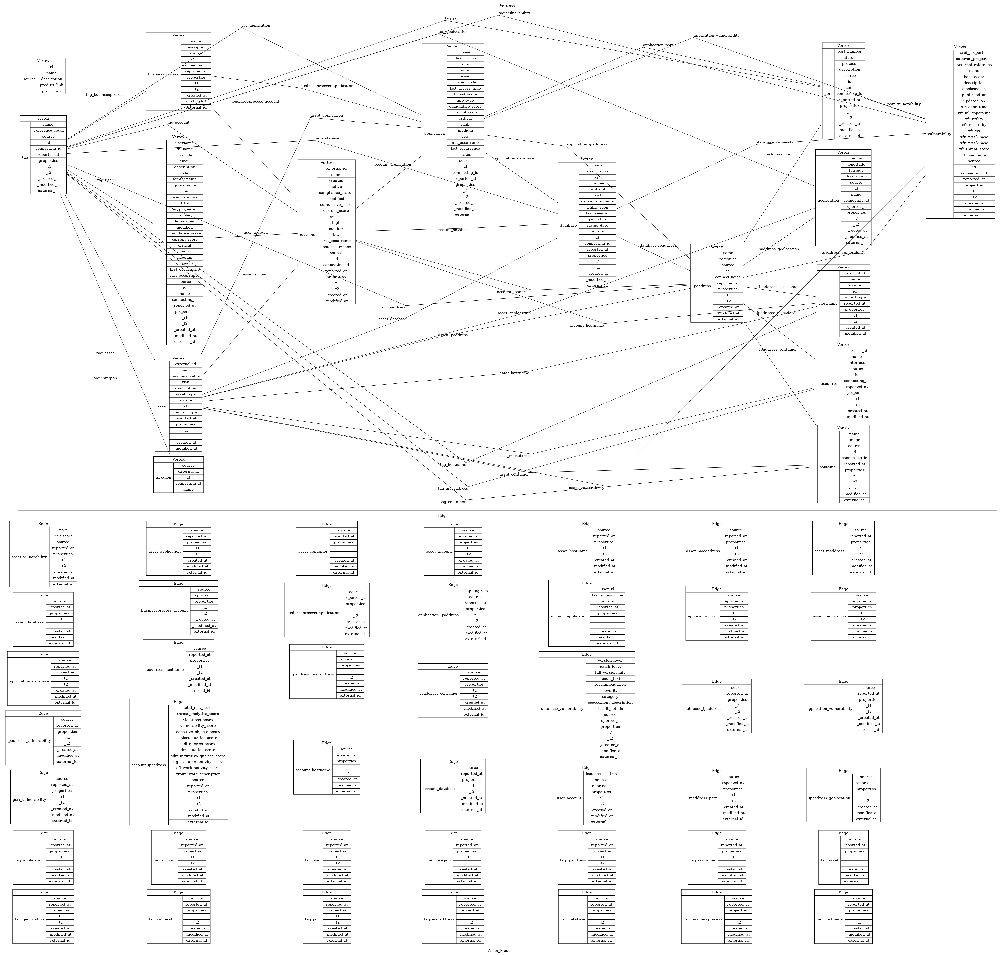

# Introduction

CAR stands for Connected Asset/Risk. It is a data service that stores clients&#39; Asset data and vulnerability/risk data related to the Assets. The data is organized as a graph where some data collections represent  graph vertices (nodes) and other collections represent edges (links/connections).

The purpose of CAR service is to provide a standard representation of Asset data. Consider a medium/large size organization that has multiple incompatible Asset-related databases and data tables. Each of those databases has a tool-set for accessing the data but there are probably no tools to unify the data across all databases and connect it to other security services. This organization could benefit from using CAR service by replicating its Asset data there and having it in unified and normalized form and connected to other CP4S services.

There are two main types of CAR service clients:
1. Connectors
2. Consumers

A CAR Connector is a component that replicates CP4S clients&#39; Asset data in CAR database and keeps them in sync after that. Connectors are developed for specific Asset data sources. Typically a CP4S client has multiple Asset data sources and it uses multiple CAR Connectors, each targeting a specific Asset data source.

CAR Consumers are CP4S services that include CAR data (or data derived from CAR data) in their UI.

# Data graph



The following is the list of data collections representing graph vertices (nodes):

asset, container, ipaddress, user, account, application, hostname, businessprocess, database, macaddress, port, vulnerability, geolocation, tag

The following is the list of data collections representing graph edges (connections):

asset_ipaddress, asset_macaddress, asset_hostname, asset_account, asset_container, asset_application, asset_database, asset_geolocation, application_port, account_application, businessprocess_application, businessprocess_account, application_database, application_vulnerability, database_ipaddress, database_vulnerability, ipaddress_container, ipaddress_macaddress, ipaddress_hostname, ipaddress_vulnerability, ipaddress_geolocation, ipaddress_port, user_account, account_database, account_hostname, account_ipaddress, port_vulnerability, tag_asset, tag_container, tag_ipaddress, tag_user, tag_account, tag_application, tag_hostname, tag_businessprocess, tag_database, tag_macaddress, tag_port, tag_vulnerability, tag_geolocation

The following is the list of collections that are not parts of the graph. They rather store graph metadata. They don't support history.

- source: This collections store properties of Asset data source such as ID, name and description.
- ipregion: This collections is used for connecting IP Regions defined by different sources.

# Collections properties

The entries in the collections described above have two kinds of properties:
1. Normalized properties
2. Custom properties

Normalized properties:
- Pre-defined
- Have types
- Stored as separate columns in the underlying Postgresql tables
- Can be used as search arguments in the CAR API
- Can be indexed

The normalized properties of a specific collection can be found in:
- [core schema](../src/schema/coreSchema.ts)
- [Postgresql schema](../src/generated/schema-version-7/pgSchema.sql)

Custom properties:
- Defined by the client
- Only of "string" type
- Stored in the single "properties" column in the underlying Postgresql tables
- Cannot be used as search arguments in the CAR API
- Cannot be indexed

# System normalized properties

- source. Every graph entity has this property. It identifies the contributing Connector. It corresponds to Asset data source on the CP4S client side. The value of this property references "id" property of the "source" collection.
- external_id. Every vertex has this property. It identifies the model entity in the source database. Edges also may have it but this is optional.
- id. Every vertex has this property. Its value is derived from "source" and "external_id" as "{source}/{external_id}"
- connecting_id. This property is used to group together vertices in the graph when it is known that those vertices represent same actual object.
- _t1/_t2. Every graph entity has them. They define "existence window" (time interval) for an entity. See "history support" for more details.

# History support

A client of CAR service can query CAR data graph for some time point in the past. To support that every entity in the graph has historical versions. For every historical version properties _t1 and _t2 define the time interval where the version is valid. When running historical query for specific time t1 we only consider versions of the entities where t1 falls between _t1 and _t2.

A client can pass in the time point argument as HTTP header 'x-hasura-car-timepoint' when sending query request. The format is ISO UTC, for example: '2021-01-25T17:52:29.785304'.

# Connecting/unifying vertices (nodes) in the graph

After different data sources (for a single client) import their data into CAR the result will be a set of disconnected graphs, each representing a corresponding data source. But in fact in many cases the entities in those graphs represent same "real" objects. The CAR data model allows both connectors and users to connect/link/unify vertices in the graphs and make an interconnected/unified graph out of multiple separate graphs created by different data sources. The tool for that is "connecting_id" property. The objects in the model that share same connecting_id are expected to be same "real" objects. The idea is that CAR-based UI will merge those connected model entities and show them as a single object to the user.

## Naturally connectable collections

Some of the data collections in the CAR model are naturally connectable. For example, in the case of "hostname" collection, when one connector creates an entity with ID "Source1/ibm.com" and another connector creates an entity with ID "Source2/ibm.com" we know that they refer to the same "real" object "ibm.com" and they can be naturally connected by connecting_id = "ibm.com".

The naturally connectable collections are:
- hostname: Connectable by host name
- ipaddress: Connectable by IP Address with taking IP Region/Domain into account
- macaddress: Connectable by MAC address

It is expected that connectors set the connecting_id property when adding data to naturally connectable collections.

## Unified users and accounts

CAR service has the code in place that connects entities in "user" and "account" collections (within a source scope and across sources) by implementing the following logic:

1. Shared accounts are those that have links to more than one user (even though those users can potentially be fragments of the same unified user we ignore this possibility for simplicity)
2. Accounts with the same value of "name" property get unified.
3. Users linked to instances of the same unified account get unified (unless it is a shared account)

## Consuming connected objects

CAR graphQL schema has "instances" collection property for every vertex entity. This property contains entities with the same "connecting_id" property value (or in other works, sibling instances of the same "real" object as the the owning vertex entity).
For example, in the example above "instances" collection property of "Source1/ibm.com" hostname entity will contain hostname entities "Source1/ibm.com" and "Source2/ibm.com" because they have same "connecting_id" = "ibm.com".

# Tags

Tags are CAR model elements (vertices) created in the scope of owning sources. If two different connectors create tags with the same name we will have two separate tag objects in the model. Tags are "naturally connectable" by name (tags with the same name owned by different source will have the same connecting_id).

There are two ways of tagging data in CAR model:

## Tagging using "tag" and "untag" pseudo-properties when importing data

"tag" and "untag" pseudo-properties can be used when importing data like in the following examples:

```
"asset": [{ "external_id": "Asset1", "name": "Asset1", "tag": ["TAG1", "TAG2"]}],
```

```
"ipaddress": [{ "_key": "1.1.1.1", "untag": ["TAG1", "TAG3"]}]
```

## Tagging using GraphQL mutations

When tagging a model element using GraphQL mutations one need to send "insert" mutation and create an edge object in a corresponding "tag_\<Vertex\>" collection. Creating a tag object itself is not required. If the tag object is missing it will be created automatically. For example for tagging "Db1" database object with the Tag "MyTag1" the following mutation query can be sent to the CAR service.

```
{ "query":
    "mutation {
          insert_tag_database(objects: {source: \"Source1\", reported_at: \"2021-05-13T20:05:37.326\", database_id: \"Source1/Db1\", tag_id: \"Source1/MyTag1\"}) {
            affected_rows
        }
}
```

See also [Example tagging script](support/tag1.py)


# REST API

We currently support two versions of the CAR service API.
- /api/car/v2: This version exists mostly for maintaining backward compatibility with existing CAR connectors.
- /api/car/v3: This version is mostly based on GraphQl.

## /api/car/v2

The following endpoints are supported:

- POST /api/car/v2/imports: Used for importing data.
- GET /api/car/v2/importstatus: Used for tracking import jobs.
- GET /api/car/v2/jobstatus: Used for tracking import jobs.
- POST/DELETE /api/car/v2/source/<source>/full-import-in-progress: Used for managing "full import" sessions.
- DELETE /api/car/v2/source/\<source\>/\<collection\>: Used for "soft" deleting entities in the CAR database.
- GET /api/car/v2/\<collection\>/\<externalId\>/graph: Finds objects related to given object and sending them back in "legacy" graph format. Used by some specific connectors. This endpoint is deprecated.
- GET /api/car/v2/\<collection\>: Finds objects in CAR database. Used by some specific connectors. This endpoint is deprecated.
- GET /api/car/v2/source/\<source\>: Finds objects in CAR database. Used by some specific connectors. This endpoint is deprecated.
- PATCH /api/car/v2/source/\<source\>: Updates "source" object in CAR database. Used by some specific connectors. This endpoint is deprecated.
- PATCH /api/car/v2/source/: Updates "source" object in CAR database. Used by some specific connectors. This endpoint is deprecated.

See [Reference Connector](https://github.com/IBM/cp4s-car-reference-connector) for examples of the usage of the endpoints listed above.

The detailed documentation for version v2 of CAR REST API can be found [here](https://github.ibm.com/CAR/UDA-Import/blob/develop/README.md#asset-import-api-endpoints).

## /api/car/v3

- GET /api/car/v3/health: Used by Kuberenetes.
- GET /api/car/v3/health/all: Used for checking the health of underlying services.
- GET /api/car/v3/hasuraAuth: Used by Hasura service for authentication of incoming requests.
- POST /api/car/v3/query: GraphQL API
- GET /api/car/v3/resetPostgresToken: used for generating "resetPostgres" token. A generated token is valid for 1 minute.
- POST /api/car/v3/resetPostgres/?token=\<token\>: used for removing all CAR data and metadata from underlying PostgresQL database.
- GET /api/car/v3/clearDbToken: used for generating "clearDb" token. A generated token is valid for 1 minute.
- POST /api/car/v3/clearDb/?token=\<token\>: used for removing CAR data for specific account. The account is identified by authenticated user sending the request.
- GET /api/car/v3/importSchema?version=<version>: display the ingestion json schema. The value of version could be v2 or v3.
- GET /api/car/v3/DataRetentionPolicy: get current data retention policy
- POST /api/car/v3/DataRetentionPolicy: used for setting data retention policy
- GET /api/car/v3/carSchema: get all the car schema extensions
- GET /api/car/v3/carSchema/{key}: get a car schema extension with the key
- POST /api/car/v3/carSchema: create or update a car schema extension
- DELETE /api/car/v3/carSchema/{key}: delete a car schema extension
- GET /api/car/v3/extensionSchema: display the extension JsonSchema. When adding an extension, it should be validated against the JsonSchema. 
The detailed documentation for version v3 of CAR REST API can be found [here](rest_api_v3.md).

# GraphQL API

The CAR service GraphQL schema is available [here](schema.json)

An example GraphQL query request:

```
curl -H "Content-Type: application/json" -X POST  http://localhost:3000/api/car/v3/query -d '{"query":"query { asset(where: {name: {_eq: \"Asset1\"}}) {  risk  }}"}'
```

# CLI

CAR service has command line interface which is not used in production scenarios but can by useful in development time or in some serviceability scenarios. To use CAR service CLI one will need to ssh into CAR service pod.

Here is the list of available commands:
- resetPostgres: Use this command to completely erase CAR data from underlying PostgresQL database. Do it every time after adopting new development version of CAR service.
- showCarData: This command prints out CAR system data (for example, initialized accounts).
- sqlQuery: This command can be used for running arbitrary SQL query in CAR database.
- dataTracker: This command prints out the contents of "data tracker" table for specified account. The table contains the info about main events related to account data such as descriptions of chunks of data imported into account. It can be used for investigating data ingestion issues.
- deleteAccount: This command deletes specified account from CAR database.
- diskUsage: Shows disk usage for specific account.

Examples of CLI usage:

```
node /opt/app-root/app/build/app.js -c resetPostgres

node /opt/app-root/app/build/app.js -c showCarData

node /opt/app-root/app/build/app.js -c dataTracker

node /opt/app-root/app/build/app.js -c sqlQuery "SELECT * FROM car.post_processing"

node /opt/app-root/app/build/app.js -c deleteAccount car_905dde6d_9728_4fd0_baa1_e1599a207a50

node /opt/app-root/app/build/app.js -c deleteAccount car_905dde6d_9728_4fd0_baa1_e1599a207a50

node /opt/app-root/app/build/app.js -c diskUsage car_905dde6d_9728_4fd0_baa1_e1599a207a50
```

For more info on how to use CLI when adopting new development build of CAR service refer to [support/upgrading_CAR_dev_image.md](support/upgrading_CAR_dev_image.md)

# Extensibility

CAR schema extensibility is documented separately [here](extensibility.md).


